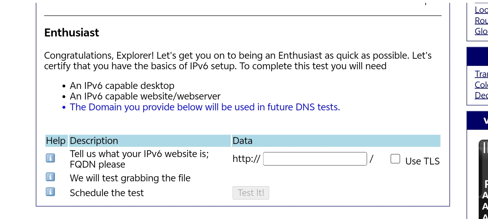
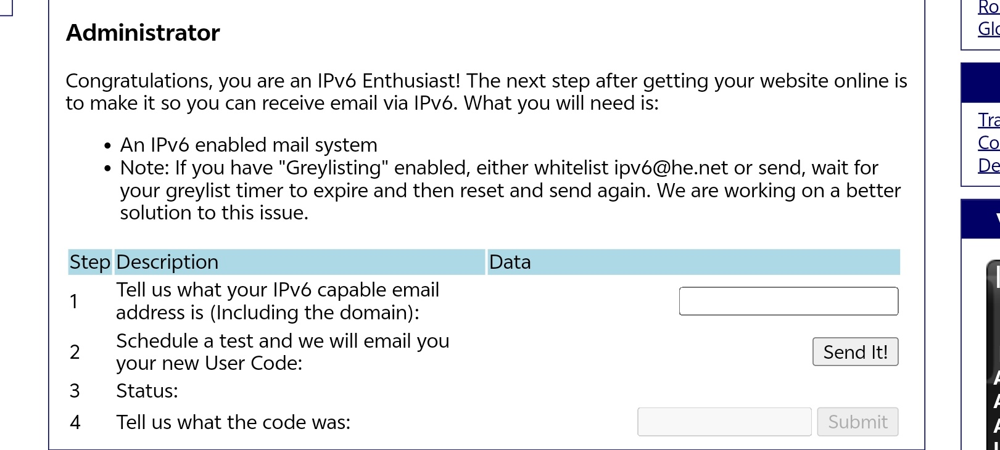
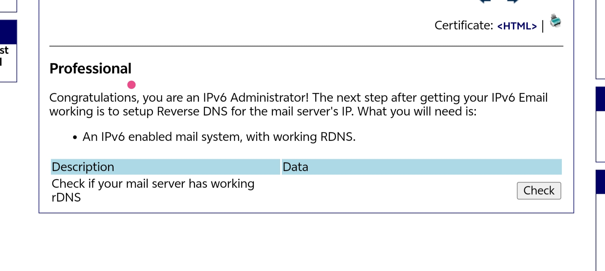
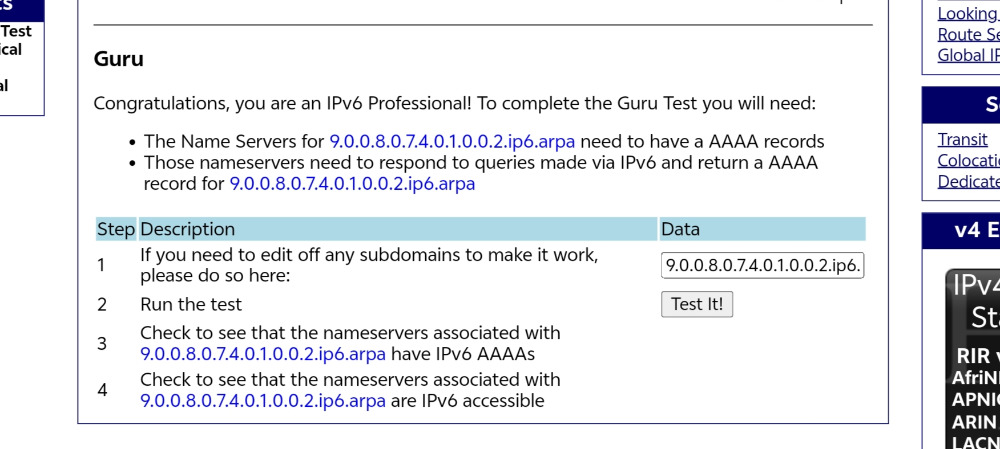
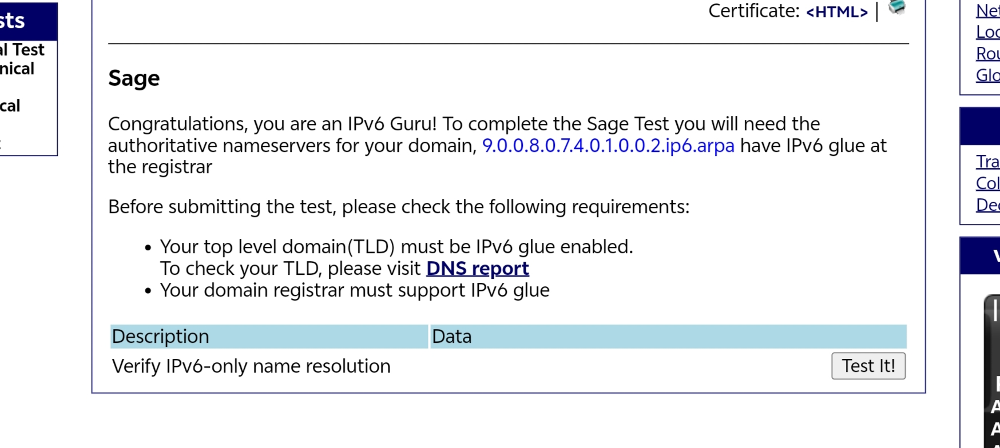

# 话说在前

Since I really have nothing else to write about, let's recall the process of this IPv6 test.
实在没文章水了，就回忆一下这个 ipv6 测试的过程吧（

## IPv6 Certifications

Welcome to the Hurricane Electric IPv6 Certification Project. This tool will allow you to certify your ability to configure IPv6 and to validate your IPv6 server's configuration.
欢迎来到 Hurricane Electric IPv6 认证项目。这个工具将允许你证明你配置 IPv6 的能力，并验证你的 IPv6 服务器的配置。

---

Through this test set you will be able to:
通过这个测试集，你将能够：

Prove that you have IPv6 connectivity
证明你拥有 IPv6 连接

Prove that you have a working IPv6 web server
证明你拥有一个可用的 IPv6 Web 服务器

Prove that you have a working IPv6 email address
证明你有一个可用的 IPv6 电子邮件地址

Prove that you have working forward IPv6 DNS
证明你有一个可用的 IPv6 转发 DNS

Prove that you have working reverse IPv6 DNS for your mail server
证明你的邮件服务器有可用的 IPv6 反向 DNS

Prove that you have name servers with IPv6 addresses that can respond to queries via IPv6
证明你拥有 IPv6 地址的名称服务器，能够通过 IPv6 响应查询

Prove your knowledge of IPv6 technologies through quick and easy testing
通过快速简便的测试证明您对 IPv6 技术的了解

---

You will also demonstrate that you are familiar with IPv6 concepts such as:
您还将证明您熟悉 IPv6 概念，例如：

the format of IPv6 addresses
IPv6 地址的格式

AAAA records
AAAA 记录

reverse DNS for IPv6
IPv6 的反向 DNS

the IPv6 localhost address
IPv6 本地主机地址

the IPv6 default route
IPv6 默认路由

the IPv6 documentation prefix
IPv6 文档前缀

the IPv6 link local prefix
IPv6 链路本地前缀

the IPv6 multicast prefix
IPv6 多播前缀

how to do an IPv6 ping
如何进行 IPv6 ping

how to do an IPv6 traceroute
如何进行 IPv6 traceroute

common IPv6 prefix lengths such as /64, /48, /32
常见的 IPv6 前缀长度，如/64、/48、/32

and more!
以及更多！

Users say that the Hurricane Electric Free IPv6 certification service is both entertaining and educational.
用户说 Hurricane Electric 免费 IPv6 认证服务既有趣又有教育意义。

We aim to provide you with something to do after your first IPv6 ping.
我们的目标是为你提供在第一次 IPv6 ping 之后可以做的事情。

By [Hurricane Electric IPv6 Certification](https://ipv6.he.net/certification/)

---

# Let's Start

Anyway, after clicking start, you will be asked to answer 5 questions about basic IPv6 knowledge. If you don't know the answers, I suggest you go confront ChatGPT.
那么话说回来，点击开始测试后，会让你回答 5 个题目，都是关于 ipv6 基础知识的，如果不会建议去和 chatgpt 对线。

After answering, your rank will become **Explorer**. Let's get to the main topic.
回答后，等级来到 Explorer，进入正题。



```
Congratulations, Explorer! Let's get you on to being an Enthusiast as quick as possible. Let's certify that you have the basics of IPv6 setup. To complete this test you will need
恭喜，探险者！让我们尽快帮助你成为爱好者。让我们证明你掌握了 IPv6 设置的基础。要完成这个测试，你需要
An IPv6 capable website/webserver
一个支持 IPv6 的网站/服务器
Tips: The Domain you provide below will be used in future DNS tests.
你下面提供的域名将用于未来的 DNS 测试
```

You need to provide a domain accessible via IPv6. HE will give you a specific filename, and their test machine will perform an HTTP GET request on this file. If the request is successful, you pass.
你需要提供一个允许 IPV6 访问的域名，然后 HE 会给出你需要创建的文件名，HE 测试机将对此文件执行 HTTP GET 请求，如果请求成功则通过。

> HE will provide the URL of the file needed for the test. All you need to do is make sure this URL is accessible via IPv6 in a browser, even if it is just a placeholder page.
>
> HE 会给出将进行测试获取的文件 URL，需要做的就是使这个 URL 能够正常被 IPV6 在浏览器访问，哪怕是占位的空页面。

> Since this is an HE test and rDNS will be verified later, let's just use an IPv6 reverse domain (ip6.arpa) for the whole process. For instructions on how to get an IPv6 reverse domain and issue SSL, please see my other article: [IPv6 Reverse Domain Acquisition and SSL Issuance](/posts/guide/ip6-arpa/).
>
> 既然是 HE 的测试，后续还要验证 rDNS，那干脆直接全程使用 IPV6 反解域名来完成，IPV6 反解域名的获取方法及 SSL 签发可以看我的另一篇文章[IPv6反解域名的获取及SSL签发](/posts/guide/ip6-arpa/)。

For example, I entered `9.0.0.8.0.7.4.0.1.0.0.2.ip6.arpa` and enabled TLS. HE will send a request to `https://9.0.0.8.0.7.4.0.1.0.0.2.ip6.arpa/autrpz6d4.txt`.
例如我填写的 `9.0.0.8.0.7.4.0.1.0.0.2.ip6.arpa`，开启 TLS，HE 将对 `https://9.0.0.8.0.7.4.0.1.0.0.2.ip6.arpa/autrpz6d4.txt` 发送请求。

> **Note**: This domain cannot be changed directly later. You can only [reset your progress to Explorer](https://ipv6.he.net/certification/reset_explorer.php).
>
> **注意**，这个域名在以后将无法直接更改，只能[重置测试进度回到Explorer](https://ipv6.he.net/certification/reset_explorer.php)。

> If you use `ip6.arpa`, please ensure you have changed the CA, otherwise SSL cannot be issued.
>
> 若使用 ip6.arpa，请确保已经更换了 CA，否则无法签发 SSL。

So how do we pass this? The easiest way is to use **Cloudflare Pages/Workers**.
那么这个怎么过呢，最简单的办法就是用 cloudflare pages/worker。

Go to Github to download the [example content](https://github.com/yCENzh/DataShare/releases/tag/IPV6Test), return to the Cloudflare dashboard, create a project, upload the Zip file, deploy, and bind your custom domain.
前往 Github 下载[示例内容](https://github.com/yCENzh/DataShare/releases/tag/IPV6Test)，回到 cloudflare 仪表盘，创建一个项目，点击上传 Zip 压缩文件，部署，然后绑定自定义域。

Return to HE, enter your bound custom domain, and click **Test It!** If passed, it will jump to the `https://ipv6.he.net/certification/testing.php?t_id=6` page. There are five questions here, which you can answer optionally, or skip directly to the [main page](https://ipv6.he.net/certification/cert-main.php) for the next level.
回到 HE，填入你绑定的自定义域，Test It! 若通过则会跳转到 `https://ipv6.he.net/certification/testing.php?t_id=6` 页面，这里有五道题，可选回答，也可直接跳转至[主页面](https://ipv6.he.net/certification/cert-main.php)，进行下一个评级。



You need an IPv6-supported email service. No need for enterprise email services; let's keep it simple and use **Cloudflare** again.
需要一个支持 IPV6 的邮件服务，不需要用企业邮箱服务，简单一点，还是 cloudflare。

Open the sidebar, go to **Email Routing**, enable automatic DNS records adding, then in the routing rules page add a custom address or Catch-all. Set the action to "Send to email", enter your email address as the destination, and verify it to receive emails via the domain email.
打开侧栏，电子邮件路由，允许自动添加 DNS 记录，然后在路由规则页面添加自定义地址或者 Catch-all，操作设置为发送到电子邮件，目标填写你的邮箱，验证后即可通过域名邮箱接受邮件。

Return to HE, enter the address, and click **Send It!** You will receive an email containing a verification code. Submit it to pass, and jump to the [new page to answer five questions](https://ipv6.he.net/certification/testing.php?t_id=7).
回到 HE，填写地址，Send It! 会收到一封包含验证码的邮件，Submit 后就过了，跳转至[新页面回答五道题目](https://ipv6.he.net/certification/testing.php?t_id=7)。

> Please do not use an Outlook email address, as Outlook's whitelist policy may cause forwarding failure.
>
> 请不要使用 outlook 邮箱，由于 outlook 的白名单会转发失败。

```
Thank you for your continued participation in our IPv6 certification program!

To complete this objective, please enter in the following code at http://ipv6.he.net/certification/

User code: cfk6q68h4q


Mail test requested by IP: 11.4.5.14
--
Hurricane Electric, LLC
760 Mission Court
Fremont, CA USA 94539
```



The **Professional** level checks if the IP of the mail server pointed to by the MX record has a PTR record (rDNS). If you use `Cloudflare Email Routing`, HE detects that your MX points to Cloudflare's server, and Cloudflare's mail server IP has a perfect PTR record. This has little to do with the domain you use; a regular `.com` with CF Email Routing can also pass the check directly.
Professional 级别是检查 MX 记录指向的邮件服务器 IP 是否有 PTR 记录（也就是 rDNS），如果使用的是 `Cloudflare Email Routing`，HE 检测到你的 MX 记录指向 Cloudflare 的服务器，而 Cloudflare 的邮件服务器 IP 是拥有完美的 PTR 记录的，这与使用的域名关系不大，用普通的 .com 配合 CF Email Routing 也能直接[Check通过](https://ipv6.he.net/certification/testing.php?t_id=8)。



In this step, HE will check if the domain's DNS server itself has an IPv6 address and can respond to queries via the IPv6 protocol. If you use Cloudflare's NS, it comes with IPv6 natively, so just click **Test It!** to pass.
这一步 HE 将会检测域名的 DNS 服务器本身是否具有 IPv6 地址，以及是否可以通过 IPv6 协议响应查询，如果使用了 Cloudflare 的 NS，天生自带 IPv6，所以直接[Test It!即可通过](https://ipv6.he.net/certification/testing.php?t_id=9)。

> The main domain here cannot be changed; it was determined when you filled it in. If you cannot pass this test due to domain reasons, you must [reset your progress to Explorer](https://ipv6.he.net/certification/reset_explorer.php).
>
> 这里的主域是不能更改的，在你填的时候就已经确定好了，如果因为域名原因无法通过这项测试，[重置测试进度回到Explorer](https://ipv6.he.net/certification/reset_explorer.php)。



Next, HE will check if the domain has IPv6 Glue Records. This requires both the Top-Level Domain (TLD) and the registrar to support IPv6 glue. `ip6.arpa` can pass directly by clicking **Test It!**.
接下来 HE 会检测域名是否有 IPV6 粘合，需要顶级域名 (TLD) 和域名注册商都支持 IPV6 粘合，ip6.arpa 直接[Test It!即可](https://ipv6.he.net/certification/testing.php?t_id=10)。

At this point, you are a glorious **IPv6 Sage**, the current highest level (although it's not terribly useful). In the past, HE would send you a free T-shirt. The original text is as follows:
至此，你就是一名光荣的 IPv6 Sage 了，目前的最高等级（虽然并没有什么用），如果换作以前，HE 可以为你寄送免费 T 恤，原文如下：

> If you wish to receive a free T-shirt for achieving Sage certification level, please click the [update information link](https://ipv6.he.net/certification/account.php) to verify your address information.
>
> 如果希望获得免费 T 恤以达到 Sage 认证级别，请点击[更新信息链接](https://ipv6.he.net/certification/account.php)验证您的地址信息

But this is a sad story. Hurricane Electric's free T-shirt distribution essentially paused around 2020 (after the pandemic began). Although the link on the official website is still there, people who reach Sage now basically don't receive T-shirts anymore. So don't get your hopes up too high, but receiving one isn't entirely impossible (you never know).
但这是一个悲伤的故事，Hurricane Electric 的免费 T 恤发放大概在 2020 年左右（疫情开始后）就已经实质性暂停了，虽然官网那个链接还在，但现在达到 Sage 的人基本都收不到 T 恤了，所以不要抱有太多期待，但也不排除收到的可能（万一呢）