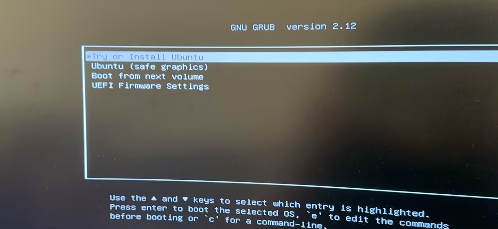
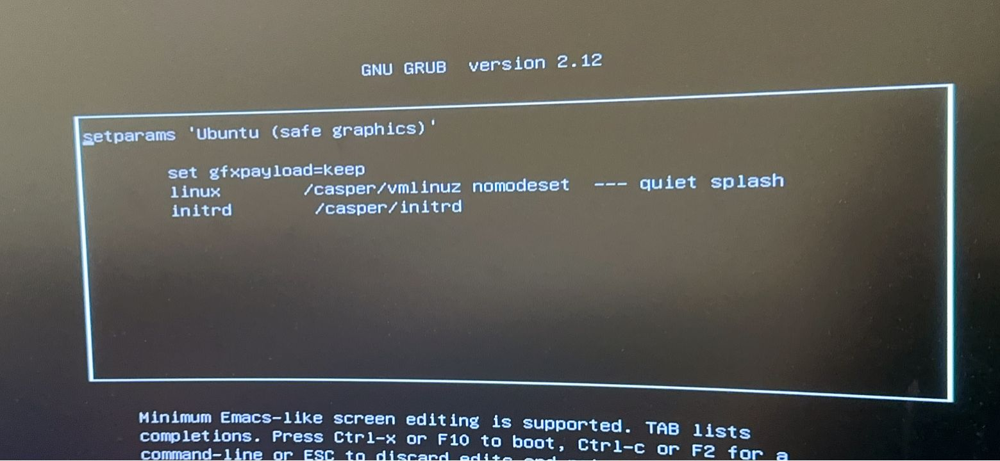
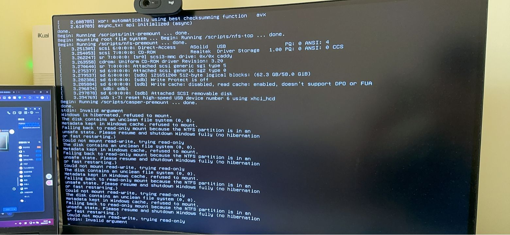
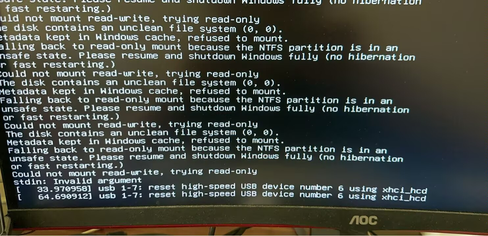
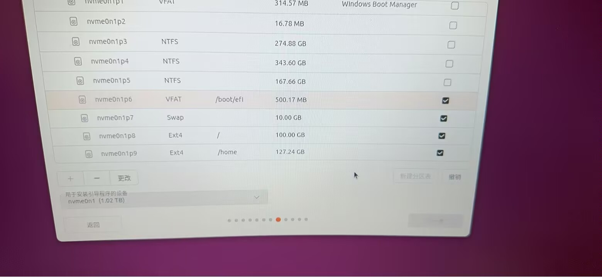
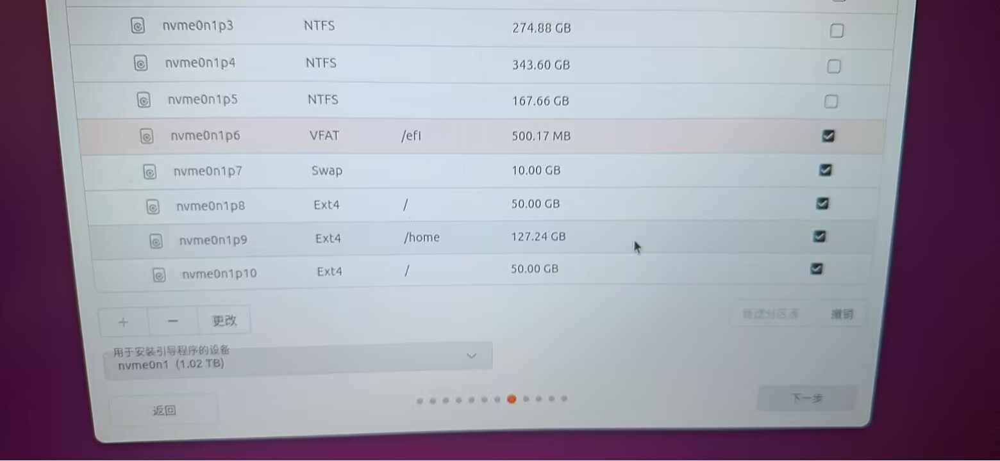
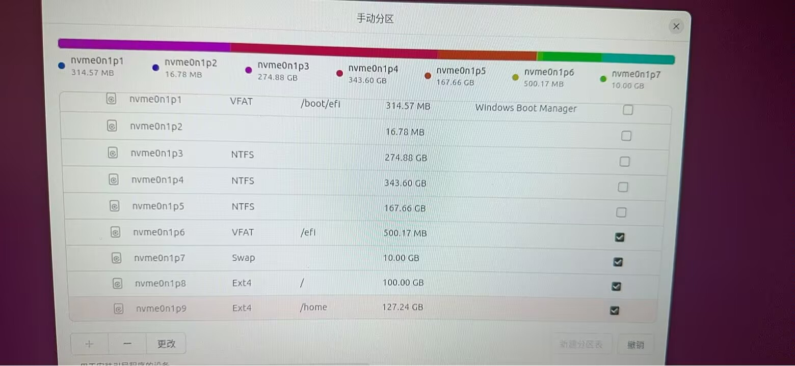

# 话说在前
~啊又来水一篇文章~,事情的起因是一个朋友[鈴奈咲桜](https://blog.sakura.ink/about/)要[重装Ubuntu](https://blog.sakura.ink/posts/ubuntu-fuck/),然后就踩坑了（（（

`鈴奈咲桜:`假人们,千万不要,突然断电,尤其是linux😭,我的停电之后数据全部错误了,打不开了😭

然后重装Ubuntu的过程中卡住了🤔


# 踩坑经历

插U盘,进引导,点击`try or install`出logo就开始转圈了

在询问后初步判断这是 NVIDIA 显卡的经典问题,安装程序默认使用的开源驱动 **Nouveau** 兼容性不佳,导致卡死,~Nvidia fuck you~

按住电源键硬重启进GRUB



选择 Ubuntu(safe graphics) 后回车........


~这个模式会自动禁用 Nouveau 驱动并使用基本图形驱动,适合 NVIDIA 显卡用户~,看来ubuntu说的也不能全信

那么就手动添加启动参数

重启进入GRUB后选中 Ubuntu(safe graphics) ,按E编辑



应该有一行类似于
```
linux /casper/vmlinuz boot=casper quiet splash ---
```
把`quiet splash`删掉,换成`nomodeset acpi=off noapic nolapic`
```
linux /casper/vmlinuz boot=casper nomodeset acpi=off noapic nolapic ---
```
也就是最终差不多这个样子,然后Ctrl X或者f10启动
*   `nomodeset`：阻止内核加载硬件自己的视频模式设置(即禁用 Nouveau)
*   `acpi=off noapic nolapic`：用于解决某些硬件配置的高级电源管理和中断问题




然后就发现了这个情况,这是个很典型的 Win+Ubuntu 双系统会碰见的问题

看这么一行报错
> The disk contains data kept in Windows hibernation... partition is in an unsafe state... trying read-only

Windows 的**快速启动**功能会在关机时将系统状态保存到硬(就休眠),这会使 Windows 的 NTFS 分区处于“不安全”状态,Linux 为避免数据损坏会拒绝挂载为读写模式

讲人话就是
>你硬盘上还有 Windows 的快速启动数据，Ubuntu 怕你误伤,拒绝挂载硬盘,结果就卡在这里了

那么怎么办呢,回到win把 快速启动 关了就行

> 如果你不要 Windows 了,可以在 GRUB 启动时加参数强制忽略此状态
> 1. 在 GRUB 菜单,选 “Ubuntu (safe graphics)”,按E
> 2. 找到 linux 那一行,在末尾加`ntfsfix force`或者`removehibernate`
> 3. Ctrl+X 启动

关了之后,插入U盘进GRUB,选中`Ubuntu (safe graphics)`后,再按E,看参数是否还在,其实这一步也是可选的,有的可能会自动保存然后就不用

确认`nomodeset acpi=off noapic nolapic`是否还在,如果没了就手动打一遍,CtrlX启动

然后应该能进Live桌面了,正常安装就行

但是重启可能还是会转圈,他默认可能还是会用回nou驱动,黑了就进`GRUB`在`linux`那行末尾加上`nomodeset`

:::note
安装类型选**alongside Windows**如果你还想双系统,或者**Erase disk**如果你不要 Windows 了
:::

~鈴奈咲桜：😭😭神医~

咳咳,不出意外的话马上就出意外了



*下一步是灰的*

可以看到有一块**nvme0n1**盘

磁盘布局如下
*   **nvme0n1** 整块磁盘
*   **p8** 分区挂载为`/`
*   **p6** EFI系统分区 挂载为 `/boot/efi`

起初以为没正确分区,~虽然最后就是分个区的事~,尝试重新分一下`/`,在打开**p8**的编辑页面后发现**好**这个按钮是灰的,~实际上是/分区已经分好了~

然后按道理来说,改一下引导分区就行,然后发现在左下角只有一整块盘可选,~没用过高版本是这样的,22.04还是太好用了~



在尝试的途中发现,这byd能分两个`/`



把`/boot/efi`改成`/efi`后,`Win Boot Manager`成功亮了起来,只能说`GPT+UEFI`还是太权威了

最终,我们聪明的鈴奈咲桜,把efi分区改成非标准的*/efi*,下一步就亮了

啊猛地想起来,byd这是双系统,**/boot/efi**存放的是WinBoot

这是Ubuntu安装程序识别 EFI 分区的逻辑问题 ,尤其是在双系统,已有 Windows EFI 分区的情况下

问题在于,该 EFI 分区已存有**Windows Boot Manager**,Ubuntu 安装程序对标准的`/boot/efi`挂载点检查非常严格,如果发现非空的EFI分区(尤其是已有Windows引导文件),会直接拒绝将其用作安装目标,导致无法继续

`/boot/efi`是标准**EFI**挂载点,Ubuntu强制检查这个分区是否是“EFI系统分区”类型,如果它发现不是空的(比如有**Windows**的EFI文件),就可能不认,导致“下一步”灰色

`/efi`非标准但可用,Ubuntu不会强制验证,Ubuntu安装程序不再将其视为“需要严格检查的标准引导分区”,而是一个普通的用于存放引导文件的分区,因此允许了安装继续,**下一步**按钮变为可用状态

~我：😭😭神医~ 天才鈴奈咲桜

当然如果强制使用`/boot/efi`也是可以的,不过会冲突,可能会破坏win的引导,当win更新时会破坏Ubuntu的引导~什么左脑攻击右脑~

就这么奇奇怪怪的装好了***Ubuntu24.04LTS***

## 可选装N卡驱动
建议安装官方的 NVIDIA 驱动,当然不打游戏区别不大
```bash
# 更新软件包列表
sudo apt update

# 安装推荐版本的驱动（自动选择最合适的）
sudo ubuntu-drivers autoinstall

# 安装完成后，必须重启系统
sudo reboot
```

> 不推荐去Nvidia官网下载.run文件安装驱动,除非有特殊需求,这种安装方式极易与系统包管理器发生冲突,且在后续内核更新后需要手动重新配置,非常容易导致系统无法启动

# 写在最后

鈴奈咲桜：😭😭神医

Me：😭😭神医

数据无价,备份第一

The end Ciallo~
