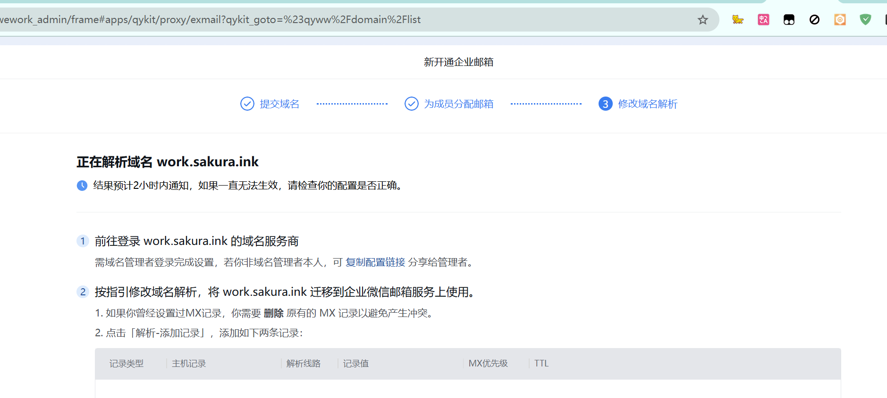
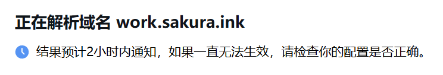
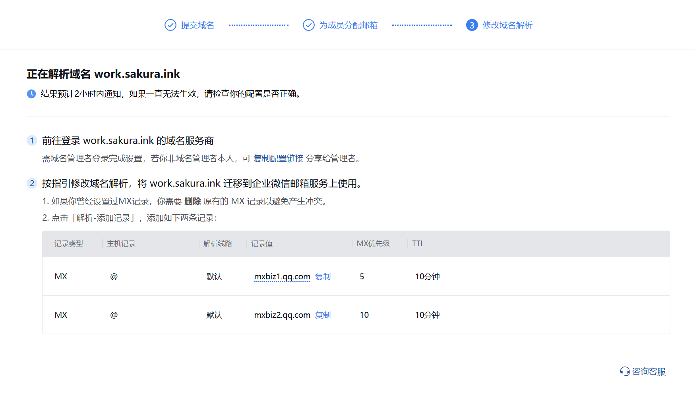
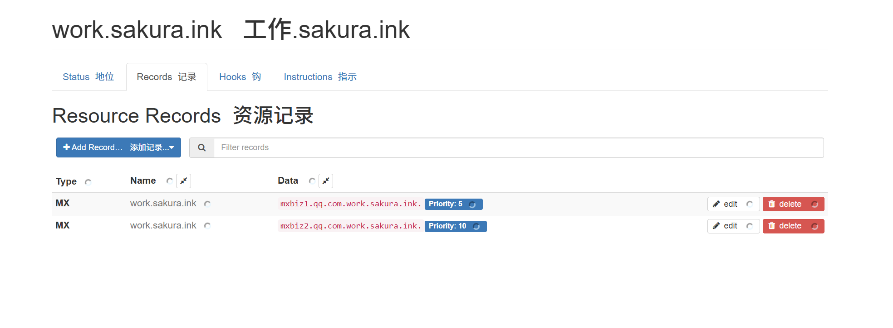
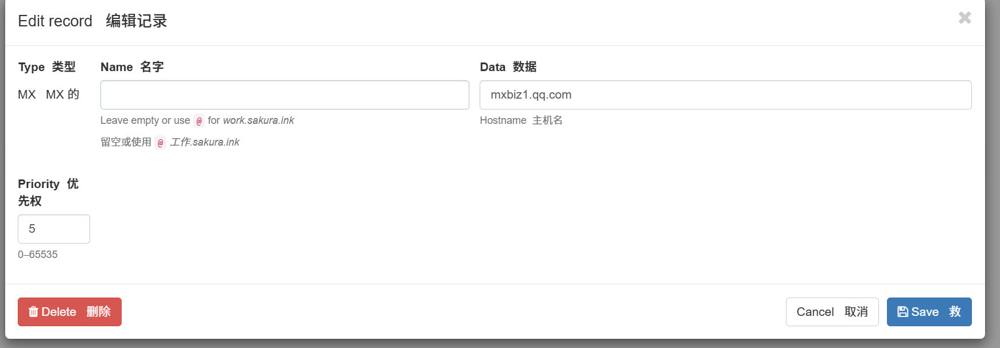
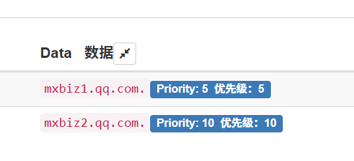
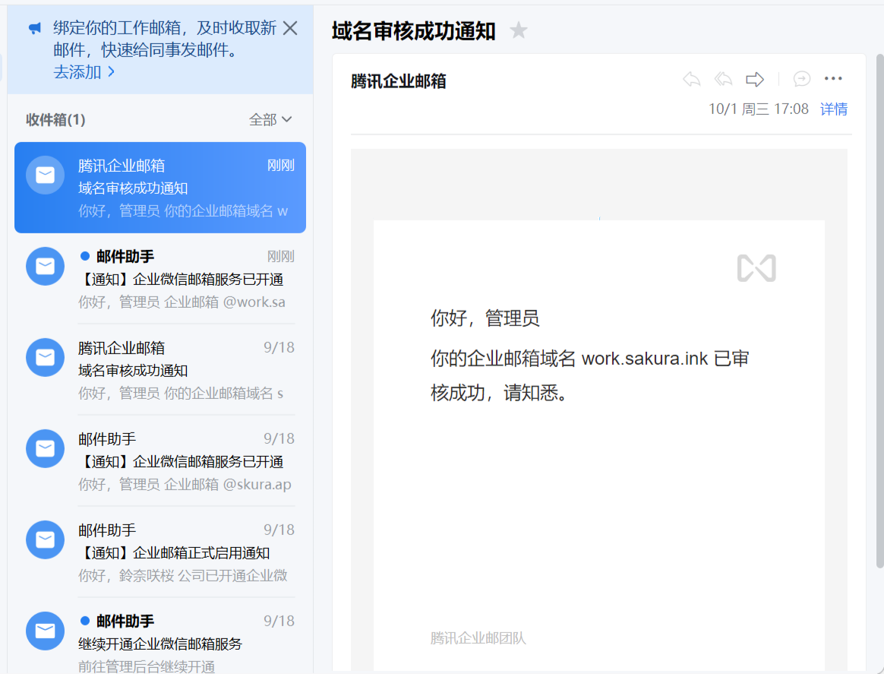

大家国庆快乐,今天10-01终于让我找到水文章的机会了,还得是奈奈（

# 奇奇怪怪的记录拼接

事情的起因是这样的,[企业微信支持绑定二级邮箱](https://blog.sakura.ink/posts/qiyewechat_mail/)



`鈴奈咲桜:`企微居然支持二级域名



`鈴奈咲桜:`好慢,是不是不支持🤔,怎么还没过

起初感觉是要解析到根域,~直接忘了MX不会自动接管子域了~

然后看到了这两张截图





思考一下有没有什么问题🤔️

---

看这个解析
```markdown
Name: work.sakura.ink
Type: MX
Value: mxbiz1.qq.com.work.sakura.in
```

这实际上相当于
```markdown
work.sakura.ink → mxbiz1.qq.com.work.sakura.in
```

这是错误的,因为这是把`MX`记录值设置成了`子域本身`,即`mxbiz1.qq.com.work.sakura.in.`,而企微要的是`mxbiz1.qq.com.`这个值,这就是为什么迟迟过不了验证

那么这是为什么呢,看下面的截图



`mxbiz1.qq.com`后面并没有`.`,这直接导致了`mxbiz1.qq.com`这个值被当成了子域拼接 (这就是dynv6的特性吗,CF还是太好用了)



可以看到在值末尾添加上`.`之后就变成了`mxbiz1.qq.com.`而非`mxbiz1.qq.com.work.sakura.ink`~都是自动拼接害的~



等待几分钟后就通过了

---

终于能水了,果然灵感来源于生活（（（

The end Ciallo~
