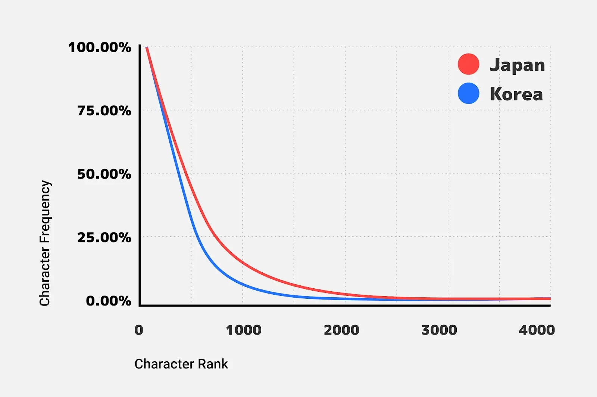

# 话说在前
Fuwari自带的robot字体个人不喜欢,遂进行关于MiSansVT的字体相关研究  

在成功替换roboto字体之后发现MiSans太大了,加载慢,然后想起之前看过的关于字体分包的相关文档,于是便有了这篇文章

# 对于加载优化方面的研究
> 若是只想看我最终的解决方法可以跳到下一标题

## 字体格式
MiSansVF官网给出的格式是ttf,大小19Mb,一开始尝试直接使用ttf字体,[PageSpeed Insights](https://pagespeed.web.dev/)中`FCP`达到了`4.9s`🤨,这成绩太夸张了  

于是使用字体格式转换工具转成.woff2

为什么使用`woff2`？

1. 更高的压缩率：WOFF2 使用了更先进的压缩算法，可以显著减小字体文件的大小。相对于 WOFF1，WOFF2 通常可以将字体文件大小减小约 30%至 50%。这对于网页的加载速度和用户体验非常重要，尤其是在移动设备和低带宽网络环境下  
2. 更好的性能：由于 WOFF2 文件更小，下载和解析的速度更快，因此可以提供更快的字体加载时间。这可以减少网页的加载时间，提高性能，并为用户提供更好的体验  
3. 支持更多字形和特性：WOFF2 支持更多的字形和字体特性，例如更多的 OpenType 功能，包括连字、字体变体和语言特定的字形。这使得设计师和开发人员可以更自由地使用各种字体效果，从而增强网页的视觉吸引力和创意性  
4. 向后兼容性：尽管 WOFF2 是对 WOFF 的改进，但它仍然具有向后兼容性。现代的 Web 浏览器一般都能够解析和显示 WOFF2 格式，而对于不支持 WOFF2 的旧版本浏览器，它们仍然可以使用 WOFF 格式进行字体呈现  

```css
@font-face {
  font-family: "MISans VF";
  src: url("/static/fonts/MiSansVF.woff2") format("woff2");
  font-weight: normal;
  font-style: normal;
  font-display: swap;
}
```
然后修改`tailwind.config.js`的配置,将`MiSansVF`设置为第一选择字体
```js title="tailwind.config.js"
...
theme: {
  extend: {
    fontFamily: {
      sans: ["MISans VF", ...defaultTheme.fontFamily.sans],
    },
  }
}
...
```

> ```js
> defaultTheme.fontFamily.sans   // ≈ ["ui-sans-serif", "system-ui", "-apple-system", "BlinkMacSystemFont", "Segoe UI", "Roboto", "Helvetica Neue", "Arial", "Noto Sans", "sans-serif", "Apple Color Emoji", "Segoe UI Emoji", "Segoe UI Symbol", "Noto Color Emoji"]
> ```
> 有人肯定会问了,这一长串是什么?后面那一串是`Tailwind`的***通用兜底列表***
> 作用很简单,当浏览器找不到`MiSansVF`时,会按顺序尝试系统字体.各大平台的默认无衬线字体,直到找到一个能用的,保证页面在任何环境下都不至于“裸奔”

:::note
浏览器会在解析 CSS 文件时遇到`@font-face`规则，然后开始异步下载字体文件。在字体文件下载完成之前，浏览器会使用默认的字体进行文本的渲染和布局。一旦字体文件下载完成，浏览器会重新应用样式，并使用自定义字体进行文本渲染  

因此`@font-face`规则不会阻塞 CSS 文件的解析和渲染。它可能会对文字的呈现产生一定的延迟，因为浏览器需要等待字体文件下载完成后才能应用自定义字体。但并不会阻塞 CSS 文件本身的渲染  

请注意，上述行为可能会导致 FOUC（Flash of Unstyled Content），即页面加载时短暂出现无样式的内容，直到字体文件下载完成并应用自定义字体。为了避免 FOUC，可以使用一些技术，如使用无衬线字体作为回退字体，或者使用字体预加载和优化技术（来避免字体闪烁问题）
:::

## 字体子集

> 这一部分拿MiSans-Regular字体举例

### 什么是字体子集

字体子集（Font Subset）是指从完整字体文件中提取出包含特定字符集的部分字体数据。字体文件通常包含了大量的字符数据，而在网页设计中，我们可能只需要使用其中的一小部分字符

将使用的字体提取为新的字体文件，这样就可以缩小字体文件，从而提高下载速度和页面加载性能

字体子集可以使用各种工具和服务来生成。这些工具会根据指定的字符集或文本内容，将字体文件中的字符提取出来，并生成包含这些字符的新的字体文件。生成的字体文件只包含所需的字符数据，因此文件大小更小，下载速度更快

> 所以说就诞生出了通过子集单独设置某个/某些字的字体的样式的方法

需要注意的是，字体子集化只适用于那些确切知道页面上将使用哪些字符的情况。如果页面上的文本是动态生成的或者包含用户输入，字体子集化可能不适用，因为无法确定需要哪些字符

我们这里的优化，没有使用该方式，我无法确定页面上的文字（虽然有解决方式，但是处理成本较高），所以我选择了下文的“字体分包”方式

### 字体子集的提取

这里使用 npm 字体 NodeJS 工具包[subset-font](https://www.npmjs.com/package/subset-font)来处理，使用非常简单，且字体格式支持较好

- SFNT (TrueType/OpenType), WOFF 或 WOFF2 文件读取与导出
- 字体子集直接设置普通字符

SFNT (Scalable Font Format) 是什么字体?

1. TrueType (TTF)：TrueType 字体是由 Apple 和 Microsoft 共同开发的一种轮廓字体技术。它使用 SFNT 格式，并支持平滑的字形轮 廓，可以在不同的显示分辨率下呈现出高质量的字形  
2. OpenType (OTF)：OpenType 字体是由 Microsoft 和 Adobe 共同开发的一种可扩展字体技术。它也使用 SFNT 格式，具有更多的功能和 灵活性，支持更多的语言和文本排版特性，包括变体字形、连字、颜色字形等  
3. PostScript (Type 1)：PostScript 字体是 Adobe 公司最早推出的一种字体格式。它使用基于 PostScript 语言的矢量描述字形，可以 在 PostScript 打印机和应用程序中使用  
4. TrueType Collection (TTC)：TrueType Collection 是一种包含多个 TrueType 字体的文件格式。它可以将多个相关字体打包在一个文件中，方便进行管理和分发  

除了上述常见的字体格式，SFNT 还可以包含其他一些字体格式的变体或扩展，如 CID-keyed 字体、CFF (Compact Font Format) 等

首先创建一个空的项目，安装依赖（你可以选择其他安装包管理器，这里我使用的是 yarn）
```bash
yarn init -y
yarn add subset-font
```
我们准备使用 ES 包模式，要设置下 package.json 中的 type
```json title="package.json"
{
  "type": "module",
  "dependencies": {
    "subset-font": "^2.1.0"
  }
}
```
创建 main.js 文件
```js title="main.js"
import subsetFont from "subset-font";
import * as fs from "node:fs/promises";

async function run() {
  console.time("run");
  const woff2Font = await fs.readFile("./fonts/MiSans-Regular.woff2");

  const subsetBuffer = await subsetFont(woff2Font, "网页中文字体加载速度优化", {
    targetFormat: "woff2",
  });

  await fs.writeFile("./out/MiSans-Regular.woff2", subsetBuffer);
  console.timeEnd("run");
}

run();
```
- 这里使用 console.time / console.timeEnd 来统计执行时长
- 读取字体文件，这里读取的是 woff2 文件
- 子集化处理 subsetFont 第一个参数是字体文件的 Buffer, 第二个是字符子集字符串，第三个参数 targetFormat: "woff2" 表示转换的结果字体 Buffer 的格式
- 将 Buffer 保存为文件
运行
```bash
$ node ./main.js

run: 478.784ms
```
可以看到用时约 0.5s，还是很快的
```bash
.
├── demo.html
├── fonts
│   └── MiSans-Regular.woff2
├── main.js
├── out
│   └── MiSans-Regular.woff2
├── package.json
└── yarn.lock

2 directories, 6 files
```
- 字体： 4,847,960 字节（约4.8 MB）
- 子集： 1,668 字节（约4 KB）
注意到，上面的文件树有个 demo.html 这是用来测速子集字体的
```html title="demo.html"
<!DOCTYPE html>
<html lang="en">
  <head>
    <style>
      @font-face {
        font-family: "SUB";
        src: url("./out/MiSans-Regular.woff2") format("woff2");
        font-weight: normal;
        font-style: normal;
        font-display: swap;
      }
      @font-face {
        font-family: "FULL";
        src: url("./fonts/MiSans-Regular.woff2") format("woff2");
        font-weight: normal;
        font-style: normal;
        font-display: swap;
      }
      .full {
        font-size: 32px;
        font-family: "FULL";
      }
      .sub {
        font-size: 32px;
        font-family: "SUB", sans-serif;
      }
      .base {
        /* 中文 */
        font-size: 32px;
        font-family: sans-serif;
      }

      #input {
        width: 400px;
        height: 200px;
      }
      .box {
        border: 1px solid #333;
      }
    </style>
  </head>
  <body>
    <div>
      <textarea id="input"></textarea>
    </div>
    <div class="box">
      <div>MISans 子集</div>
      <p class="sub content"></p>
      <hr />
      <div>MISans</div>
      <p class="full content"></p>
      <hr />
      <div>无字体</div>
      <p class="base content"></p>
    </div>

    <script>
      const input$ = document.querySelector("#input");
      const contents$ = document.querySelectorAll(".content");
      input$.addEventListener("input", (e) => {
        contents$.forEach((content$) => {
          content$.textContent = e.target.value;
        });
      });
    </script>
  </body>
</html>
```
如果你访问demo可见,只有子集内包含的字符才会显示字体效果,否则默认(以css和操作系统为准)
[在线的字体提取工具](https://font-subset.disidu.com/),但是不保证有效,有可能无法访问

字体的子集是按需提取一个单独的子集，这样的话 🤔

- 可以将常用文字直接提取，虽然这能应对一些场景，但这不是最优解
- 我们还可以用工具抓取页面的字体集，再做子集话，但无法应对动态内容的场景

那么有没有一种方式可以保留所有字体，又能压缩字体文件大小呢?

## 字体分包

> ~有的兄弟有的~ 答案是字体分包

2017 年,Google Fonts 提出了切片字体,用于提高 CJK 字体的加载速度,自 2019 年后,切片字体已经应用于所有的 `Noto Sans` 网络字体中,本文基于 Google Fonts 的切片字体字符集,展示如何自行生成切片字体

### 何为切片

CJK 字体由于包含的字符较多，占用容量自然较大，在 Web 中使用一直是一个比较大的问题

Google Fonts 团队在 2018 年发表了一篇[博文](https://developers.googleblog.com/2018/09/google-fonts-launches-japanese-support.html)，提出了切片字体方案

团队首先从数以百万计的日语网页中收集了日文字符的使用频率数据，并对其进行分析



由图可以明显看到，若将图片分为两部分，存在一部分使用频率较高但字符较少的字符集，和一部分使用频率较低但字符较多的字符集 “尾巴”。

由此，团队使用了以下的字符切片策略：

1. 将 2000 个最流行的字符放在一个切片中
2. 将 1000 个次受欢迎的字符放在另一个切片中
3. 按 Unicode 编码对剩下的字符进行分类，并将它们分成 100 个大小相同的切片

用户在浏览网页时，只需下载页面上的字符所需的切片。根据团队的统计结果，这种情况下下载的字节数比发送整个字体少了 88%。进一步的，切片字体依赖的核心功能是  unicode-range  和 woff2，而支持这两项功能的浏览器也支持 HTTP/2，HTTP/2 可以实现许多小文件的同时传输。

为此，针对韩文字体，团队做了进一步的改进：

1. 将 2000 个最流行的字符放在 20 个相同大小的切片中
2. 按 Unicode 编码对剩下的字符进行分类，并将它们分成 100 个大小相同的切片
3. 根据团队的统计结果，这种情况下下载的字节数比之前的最佳策略少了 38%。

最终，团队将这样的切片字体策略应用到了 CJK 字体中，并且针对不同语言调整了字符集大小和切片大小

## 中文网字计划

前言都聊完了,那么现在请出唯一真神:[中文网字计划](https://chinese-font.netlify.app/zh-cn/?ref=fuwari.oh1.top)

中文网字计划开发并开源了
- 字体分包插件
- 字体管理系统
- 开源 WebFont
- 在线字体分包器
- 在线字体检查报告

### 对字体进行分包

我们直接使用在线字体分包器来处理,打开中文网字计划[在线字体分包器](https://chinese-font.netlify.app/zh-cn/online-split/)

点击左侧选择字体文件，支持 SFNT (TrueType/OpenType), WOFF 或 WOFF2

我们这里选择 MISansVF.woff2 文件

分包完毕后，点击右下角的“压缩下载 zip” 按钮。下载一个 zip 文件，解压后会得到very very多的文件

```bash
tree .
.
├── 07b77a49c72949a4e96646cf5f8abbd8.woff2
├── ...
├── 092b713f787faaad31ca9e849db32968.woff2
├── index.html
├── preview.svg
├── reporter.json
└── result.css
```
这里每个 woff2 都是分包文件，且文件的大小在 70KB 以下

> 好奇怎么运行的?
> - [字体分包器运行原理](https://chinese-font.netlify.app/zh-cn/post/cn_font_split_design)
> 其他不再赘述,详见[官网](https://chinese-font.netlify.app/zh-cn/article/)

### 生成字体产物介绍

- result.css: 入口 css 文件，前端代码直接引用它即可
- woff2 字体: 核心产物，经过 cn-font-split 优化的字体分包
- index.html: 用于测试的网页文件，可以通过端口看到整个包的分包后效果
- reporter.json: cn-font-split 的报告文件, 其中包含 woff2 的分析和引用数据

我们使用服务运行下 index.html, 使用终端进入文件夹，运行以下命令

```bash
$ npx http-server . -p 5000
Starting up http-server, serving .

http-server version: 14.1.1

http-server settings:
CORS: disabled
Cache: 3600 seconds
Connection Timeout: 120 seconds
Directory Listings: visible
AutoIndex: visible
Serve GZIP Files: false
Serve Brotli Files: false
Default File Extension: none

Available on:
  http://127.0.0.1:5000
Hit CTRL-C to stop the server
```

使用浏览器打开http://127.0.0.1:5000,这里有字体的切片信息,我们 ⬇️ 滚动到底部,可以看到,每个切片的字符位数不同,越向顶部,字符字形越复杂

使用编辑器查看 result.css 可以看到有很多的 @font-face 而这些 @font-face 都设置了 unicode-range 属性，值是字符 Unicode 码点范围

### 使用分包

将字体文件放到 CDN 服务或者直接放在项目的静态目录下，如项目的 public/fonts/...，之后将 result.css 引入到项目，设置 tailwind.config.js
```js title="tailwind.config.js"
...
theme: {
  extend: {
    fontFamily: {
      sans: ["MISans VF", ...defaultTheme.fontFamily.sans],
    },
  }
}
...
如何是 CDN 的话，需要将字体文件，result.css 文件上传，直接引用 link:css
```
<link
  rel="stylesheet"
  crossorigin="anonymous"
  href="https://cdn.xxx.com/fonts/result.css"
/>
```

### 另辟新路

中文网字开源了 cn-font-split 可以使用它的 npm 包
```bash
npm install @konghayao/cn-font-split
```
命令行使用
```bash
# -i 输入 -o 输出
cn-font-split -i=../demo/public/SmileySans-Oblique.ttf -o=./temp

# 参数与正常 js 操作是一样的，深层json则需要使用 . 来赋值
cn-font-split -i=../demo/public/SmileySans-Oblique.ttf -o=./temp --renameOutputFont=[hash:10][ext] --css.fontWeight=700

# 显示输入参数说明，虽然会显示 typescript 类型。。。
cn-font-split -h
```
基础代码
```js title="index.mjs"
// index.mjs
import fs from "fs-extra";
import { fontSplit } from "../dist/index.js";
fontSplit({
  // 这是打包后的目录
  destFold: "./temp/node",
  // 这个是原始字体包
  FontPath: "../demo/public/SmileySans-Oblique.ttf",
});
```
cn-font-split 也是支持自定义子集的，这就代表，我们可以子集设置分包子集的优先级实现更高字符权重
```js
{
  // 关闭自动分包，那么只会打包你 subsets 中指定的字符
  autoChunk: false,

  // 强制分包，优先于自动分包
  subsets: [
    // 这个是单独一个包，只包含 unicode 为 31105 和 8413 的字符
    [31105, 8413]
  ],
}
```
当然，我们一般都会采用字符串而不是 unicode 这种方式操作，那么使用下面的方式比较合适
```js
{
  subsets: [
    '中文网字计划'
      .split('')
      .filter(Boolean)
      .map((i) => i.charCodeAt(0))
  ],
}
```
> 更高级的子集分包方案可以使用 font-subset ，它实现了 WEB 字体子集化，提速字体加载/按需加载，直接使用内置谷歌、哔哩哔哩、小米的子集化方案

# 最终方案

## 我的提交

那么话说完了,现在写一下我的最终提交方案

1. 卸载roboto字体包(可选)
> 我这个人有点强迫症,所以卸了
```bash
pnpm remove @fontsource/roboto
```

2. 新建fonts.css
> 我这里选择的是通过外置CSS来引入字体,当然你也可以选择直接在layout中引用  
> 若是你不选择分包字体将下面改一下就行,真不会就去和ai对线
```css title="fonts.css"
/* src/styles/fonts.css */

/* 引入分包后的字体文件 */
@import url('/MiSansVF/result.css');

/* 定义 CSS 变量 */
:root {
    --font-family-base: 'MiSans VF', system-ui, -apple-system, 'Segoe UI', sans-serif;
    --font-family-mono: 'JetBrains Mono Variable', 'Consolas', monospace;
}

/* 全局字体设置 */
html {
    font-family: var(--font-family-base);
    -webkit-font-smoothing: antialiased;
    -moz-osx-font-smoothing: grayscale;
}

body {
    font-family: var(--font-family-base);
}

/* 代码字体设置（可选） */
code, kbd, samp, pre {
    font-family: var(--font-family-mono);
}

/* 确保 Tailwind 的 font-sans 类使用 MiSans（可选） */
.font-sans {
    font-family: var(--font-family-base) !important;
}
```

3. 新建Fonts.astro
> 既然都新建CSS了,那我再新建一个astro也不过分的  
> 我这里对于expressive-code代码块字体的处理是了jetbrains-mono,你也可以换成其他字体,不用MiSans原因是她不等宽  
```astro
---
// src/layouts/Fonts.astro
import "@fontsource-variable/jetbrains-mono"; // 这个是code字体,原本在Layout.astro中,我强迫症遂将其移至此文件
import '../styles/fonts.css';
import '../styles/main.css';
---

<meta charset="UTF-8">
<meta name="viewport" content="width=device-width, initial-scale=1.0">
<link rel="preload" href="/fonts/result.css" as="style">
```

4. 修改Layout.astro
```astro title="Layout.astro"
---
import Fonts from './Fonts.astro'; //导入字体astro
...
	<head>
	    <Fonts /> //将字体样式添加至head中
	...
	<head>
...
```

## 修改code字体（可选）
将其他文件中code相关的字体替换就行  
需要更改挺多文件的,建议用IDE全局搜索code找相关字眼  

# 写在最后

我也不知道写什么(  

字体分包的这种解决方法吧,整挺好,就是在不理想的情况下第一次加载的时候......~挺抽象的~ 不,应该说是非常抽象  

总结都是这破网害的  

## 优化效果
- **字体文件大小**：从 19MB (TTF) → 11.8MB (WOFF2) → 分包后按需加载（平均 <500KB）
- **FCP 指标**：从 4.9s → 09s 左右?我自己都震惊了,感觉像bug,结论仅供参考

## 相关资源
- [MiSans 官方仓库](https://github.com/dsrkafuu/misans)
- [中文网字计划](https://chinese-font.netlify.app/)
- [Google Fonts 字体优化指南](https://web.dev/optimize-webfont-loading/)
- 还参考了一些博文,但是记不太清了,浏览记录太杂了,怎么总感觉这篇文章跟哪篇相似呢

---

*本文所有代码和配置均已在 Fuwari 主题上测试通过，理论上适用于所有 Astro 项目*

The end Ciallo~